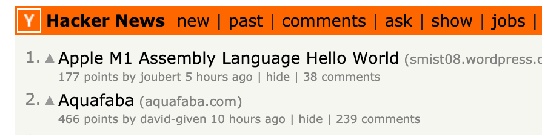
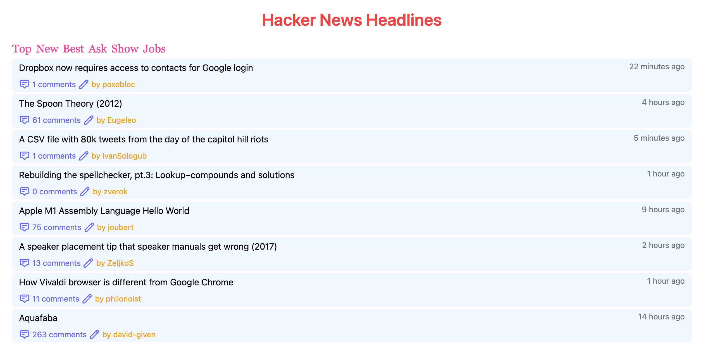
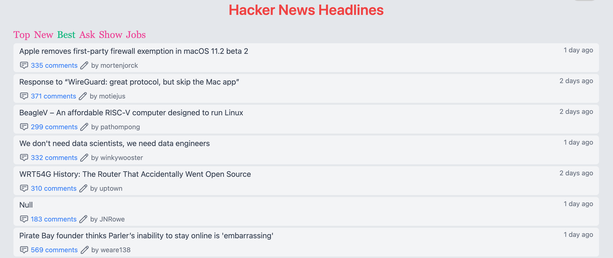
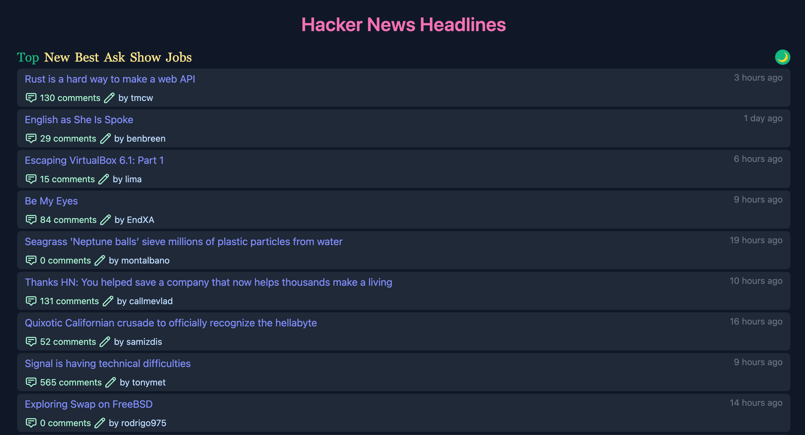

After building a very basic Single Page Application (SPA) from the first article, today we gonna continue to enhance the application. Our goals in this article are:

- Fetch more kinds of items from HackerNews (previously, the site just received only top stories) with a proper mini navigation.
- Add Dark Mode feature
- Use localStorage to save user preferences: the last selected sections, and the theme mode

We use the current [release](https://github.com/infantiablue/vhnews/releases/tag/0.1) from Github to continue development. Look at the HackerNews homepage, we can see it has other sections such as *new, jobs , asks ...* and go through the [official API](https://github.com/HackerNews/API), all of them are supported through REST APIs. Here are URL endpoints:



```html
https://hacker-news.firebaseio.com/v0/topstories.json?print=pretty
https://hacker-news.firebaseio.com/v0/beststories.json?print=pretty
https://hacker-news.firebaseio.com/v0/newstories.json?print=pretty
https://hacker-news.firebaseio.com/v0/askstories.json?print=pretty
https://hacker-news.firebaseio.com/v0/showstories.json?print=pretty
https://hacker-news.firebaseio.com/v0/jobstories.json?print=pretty
```

When examining the URL endpoints, there is a pattern, which we can make use for our app: `${topic}stories`. Let's implement in the user interface. Firstly, we add a property to Vue app, an array with topics, and their titles:

```javascript
data() {
  return {
    topics: [
      { key: "top", title: "Top" },
      { key: "new", title: "New" },
      { key: "best", title: "Best" },
      { key: "ask", title: "Ask" },
      { key: "show", title: "Show" },
      { key: "job", title: "Jobs" },
    ],
  };
```

With this desing of data, we can customize such as icons, color ... for the topic navigation with ease. Then, we generate the navigation bar by using `v-for`

```html
<div class="flex items-baseline">
  <div class="flex text-blue-500 text-xl">
    <span class="tab mr-2 cursor-pointer font-serif" v-for="topic in topics" :key="topic.key" @click="loadStories(topic.key, $event)>{{ topic.title }}</span>
  </div>
</div>
```



The `$event` param would be used to manipulate css class later. And, I must say, the Tailwind CSS framework is so powerful, especially in this kind of scenario, I don't need to hard code other css class, just use built in class utilites to decorate the elements.

Nest step, we need functions to make UI wokrs, we gonna implement a method to load each topic when user click on. It's just a simple function to `dispatch` the `fetchItems` action from Vuex store with a param (we will modify it later). Also, we need a mechanism to highlight the active topic, by adding & removing a text color class from tailwind.

```javascript
methods: {
  loadStories(topic, evt) {
    this.$store.dispatch("fetchItems", topic);
    localStorage.topic = topic;
    document.querySelectorAll(".tab").forEach((elm) => {
      elm.classList.remove("text-green-500");
    });
    evt.target.classList.add("text-green-500");
  },
},
```

Now, for the Vuex Store action, we will rename and modify the function `loadLatestTopItems` in `store/index.js` as below:

```javascript
fetchItems(context, type = "top") {
  context.commit("clearItems");
  api
    .get(`${type}stories.json?limitToFirst=20&orderBy="$key"`)
    .then((res) => {
      res.data.forEach((id) => {
        api.get(`item/${id}.json?print=pretty`).then((res) => {
          context.commit("loadItems", res.data);
        });
      });
    })
    .catch((error) => {
      console.error(error);
    });
},
```

The new function take the type params (with default is `top`) and then pass diretly to the API url endpoint by using the template literal feature. Now, run the command `yarn dev` and open `http://localhost:3000` to check if everything works. It should wokrs properly, however the problem is when you load the page first time, the `active` topic is not highlight, we need a solution for this.

```javascript
created() {
  this.loadStories("top");
},
mounted() {
  this.$refs["topic-top"].classList.add("text-yellow-500");
},
```

The code is easy to understand, we load top stories by using the defined method `loadStories` when the component is `created` but at this stage of the Vue instance lifecyle, the DOM is not ready yet, so we need to put the next chunk of code to the `mounted` event, in order to highlight the top stories topic.



Okay, the interesting part, implement dark mode for our application. Fortunately, Tailwind have supported this feature out of the box. *"To make this as easy as possible, Tailwind includes a `dark` variant that lets you style your site differently when dark mode is enabled"*

Then, we are going to implement `dark` class to our applications. Firstly we make some fundamentals class in the `main.css` file in `src/assets/css`.

```css
/*! @import */
@tailwind base;
@layer base {
  html,
  body {
    @apply bg-gray-200 dark:bg-gray-900 dark:text-gray-300 h-full;
  }
  #app {
    @apply bg-gray-200 dark:bg-gray-900 h-full;
  }
  a {
    @apply text-blue-500 hover:text-pink-500 dark:text-pink-500 dark:hover:text-indigo-500;
  }
}
@tailwind components;
@tailwind utilities;
```

In this step, the color is totally up to your taste, the full source code is availabel on Github for your references. In order to save users' preferences, `localStorage` is an execellent choice for a SPA app like this. From MDN, *"The read-only localStorage property allows you to access a Storage object for the Document's origin; the stored data is saved across browser sessions. localStorage is similar to sessionStorage, except that while data stored in localStorage has no expiration time"* The function `toggleDarkMode` below is written base on it. The function will accept a parameter to set the intended theme (which we can use when initializing the application) or toggle it.

```javascript
toggleDarkMode(theme, evt) {
  let htmlElm = document.querySelector("html");
  const setLight = () => {
    htmlElm.classList.remove("dark");
    localStorage.theme = "light";
    this.$refs.toggleDark.textContent = "☀️";
  };
  const setDark = () => {
    htmlElm.classList.add("dark");
    localStorage.theme = "dark";
    this.$refs.toggleDark.textContent = "🌙";
  };

  if (typeof theme === "string") {
    if (theme == "dark") setDark();
    else setLight();
  } else {
    if (localStorage.theme === "dark") setLight();
    else setDark();
  }
},
```

We inject an icon (I just make use of the emoj for the quick implementation) for user to switch theme in the `template` section of the file `App.vue`

```html
<div class="theme-switch-wrapper">
  <span ref="toggleDark" class="h-6 w-6 flex items-center justify-center cursor-pointer bg-blue-500 dark:bg-green-500 rounded-full" @click="toggleDarkMode">☀️</span>
</div>
```

And check it out.



Finally, we set up some varaiables when initializing the apllication, to load users' preferences.

```javascript
created() {
  if (!("topic" in localStorage)) localStorage.topic = "top";
  this.loadStories(localStorage.topic);
  if (!("theme" in localStorage)) localStorage.theme = "dark";
},
mounted() {
  this.toggleDarkMode(localStorage.theme);
  this.$refs[`topic-${localStorage.topic}`].classList.add("text-green-500");
},
```

The the application will loaded the last topic, browsed by user or the selected theme for the next session. The completed working code is updated on the [Github repo](https://github.com/infantiablue/vhnews) and the [live demo](http://vhnews.netlify.app/) is still there (updated the latest version).
